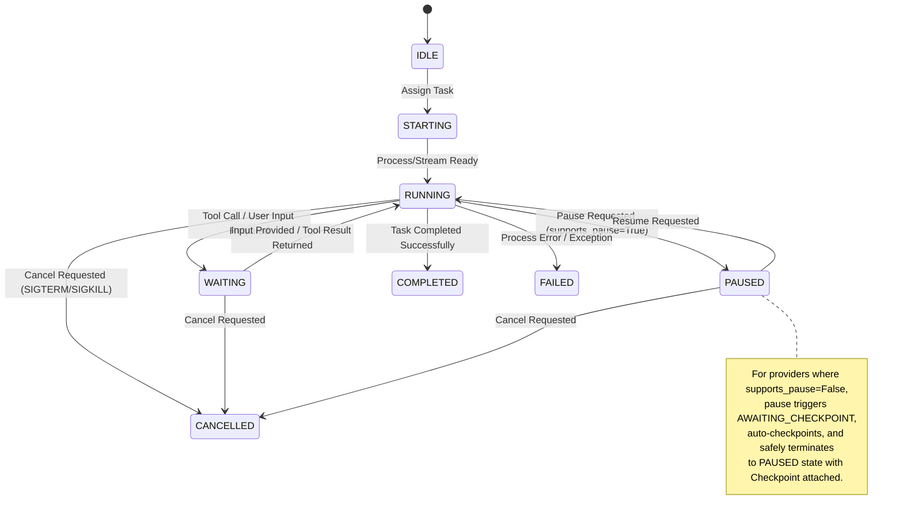

# AIOS Context Engine Architecture

## 1. Overview & Mission
AIOS Context Engine is a local-first AI operating layer and context broker designed to supervise software-development agents, manage task workflows, maintain persistent memory across sessions, and eliminate token bloat through minimal, high-precision context packets.

### Core Objectives
1. **Agent Supervision:** Provide unified lifecycle management (`IDLE` to `COMPLETED`/`FAILED`/`CANCELLED`) for heterogeneous agents (CLI subprocesses and API models).
2. **Context Economy:** Assemble 4-tier minimal context packets using Tree-sitter AST extraction and semantic vector retrieval instead of dumping entire repositories.
3. **Auditable Analytics:** Track token usage and provable tokens avoided ($\text{Candidate Tokens} - \text{Dispatched Tokens}$).
4. **Session Durability:** Capture uncommitted git state and decisions in Universal Handoff Envelopes for seamless cross-agent resumption.
5. **Direct MCP Connectivity:** Expose context, memory, and task state over the Model Context Protocol (MCP).
6. **No-Circumvention Rule:** Strictly avoid browser automation, undocumented APIs, or account switching. Truthfully report unsupported capabilities.

---

## 2. System Topology & Architectural Style

AIOS is built as a **Modular Monolith**:

```
aios/
  apps/
    web/            # Next.js App Router UI (Tailwind, shadcn/ui, TanStack Query, Zustand, Recharts)
    api/            # FastAPI Daemon (REST & WebSocket event bus)
    cli/            # Typer CLI for local developer operations
    mcp/            # Local Model Context Protocol (MCP) server
  packages/
    core/           # Domain entities, base schemas, permissions, events
    agents/         # Agent lifecycle supervisor & state machine
    context/        # 4-tier context packet builder & token counters
    memory/         # Persistent project memory & decision log (ADRs)
    indexing/       # Tree-sitter code parser & sqlite-vec embeddings
    tasks/          # Task queue, session management, and checkpointing
    analytics/      # Auditable token metrics & efficiency calculations
    providers/      # Adapters for Ollama, Codex, and Antigravity-compatible workflows
    git/            # GitPython & git diff/patch working state capture
  data/             # Local SQLite database & vector indices
  tests/            # Unit, integration, and contract tests
  docker-compose.yml
  .env.example
  README.md
```

---

## 3. Core Domain Entities

| Entity | Description |
| :--- | :--- |
| **Project** | Root workspace container linking a local git repository, config, and security boundary. |
| **Agent** | Configured agent definition referencing an adapter, system prompt, and capabilities. |
| **AgentProvider** | Adapter instance (e.g. `OllamaProvider`, `CodexCLIProvider`, `AntigravityProvider`). |
| **AgentRun** | Concrete execution instance of an Agent on a Task with dedicated state and telemetry. |
| **Task** | Discrete development objective with requirements, acceptance criteria, and status. |
| **Session** | Longitudinal series of AgentRuns working toward common goals within a Project. |
| **Checkpoint** | Snapshot of active branch, uncommitted diff/patch, touched files, and memory state. |
| **Memory** | Persistent knowledge entry (architectural constraint, resolved bug, user rule, gotcha). |
| **Decision** | Architectural Decision Record (ADR) or tactical decision logged during an agent run. |
| **CodeSymbol** | Parsed code element (function, class, interface, method) with AST signature and path. |
| **ContextPacket** | Curated 4-tier context payload compiled under a strict token budget. |
| **TokenMetric** | Telemetry entry capturing candidate tokens, dispatched tokens, and tokens avoided. |
| **Event** | Normalized event (log output, state change, token stream, checkpoint, error). |
| **PermissionPolicy** | Security boundaries specifying allowed working paths, commands, and network flags. |

---

## 4. Agent Lifecycle State Machine

Agents transition through 8 discrete states:



---

## 5. Sandboxed Process Supervision & Path Jailing

1. **Process Group Management:** CLI subprocesses are spawned in dedicated OS process groups (`setpgid` on POSIX, Process Job Objects on Windows). Termination signals (`SIGTERM` followed by `SIGKILL` on timeout) are sent to `-pgid` to guarantee clean termination of all child and grandchild workers (e.g., node, compilers, test runners).
2. **Strict Path Jailing:** Every operation validates targeted paths against the project root via `os.path.commonpath([project_root, target_path]) == project_root`. Any attempt to traverse outside the workspace raises `PermissionPolicyViolationError` and halts execution.

---

## 6. Strict 4-Tier Context Hierarchy

To prevent signature hallucination while eliminating repository dumping, context packets are constructed across four prioritized tiers:

1. **Tier 0 (Task & Worktree):** Active Task specification, acceptance criteria, and uncommitted working-tree Git diff.
2. **Tier 1 (Signatures & Stubs):** Tree-sitter extracted signatures, interfaces, and exported types for all imported or dependency symbols (implementation bodies omitted).
3. **Tier 2 (Target Bodies):** Complete source code bodies for the primary files or symbols targeted for inspection or modification.
4. **Tier 3 (Semantic History & Decisions):** sqlite-vec indexed project decisions, architectural constraints, past bug resolutions, and failure modes relevant to the active task.

---

## 7. Universal Handoff Envelope

When resuming a session across different models or agent tools, AIOS serializes the session state into a universal format:
- **Git State:** Active branch, base commit SHA, and uncommitted unified diff patch.
- **Task Progress:** Completed checklist items and pending acceptance criteria.
- **Decision Delta:** Decisions recorded during the session.
- **Active Context:** Freshly compiled 4-Tier ContextPacket.

---

## 8. Auditable Token Mathematics

To keep analytics auditable and grounded, token calculations avoid heuristics:
$$\text{Tokens Avoided} = \text{Candidate Tokens} - \text{Dispatched Tokens}$$
$$\text{Token Efficiency Ratio} = \left(\frac{\text{Tokens Avoided}}{\text{Candidate Tokens}}\right) \times 100\%$$

- **Candidate Tokens:** Total token count of an uncurated baseline (full files in repository + full conversation history).
- **Dispatched Tokens:** Actual prompt tokens assembled in the 4-Tier `ContextPacket`.
