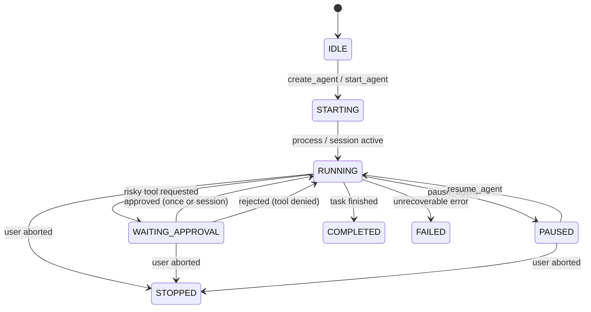

# ContextOS — Target Architecture Specification

**Version:** 1.0.0  
**Architect:** Antigravity (AGY)  
**Status:** Approved Target Blueprint

---

## 1. System Topology & Architectural Style

ContextOS is architected as a **Modular Monolith** designed for zero-latency local execution, verifiable security boundaries, and clean separation of concerns.

```text
+-------------------------------------------------------------------------+
|                         AIOS Web Control Center                         |
|  (Next.js / Vite, React 19, Tailwind CSS, shadcn/ui, assistant-ui)      |
+------------------------------------+------------------------------------+
                                     | REST & WebSocket
                                     v
+-------------------------------------------------------------------------+
|                            AIOS Core Daemon                             |
|                        (FastAPI & ASGI Runtime)                         |
|                                                                         |
|  +-------------------+  +-------------------+  +---------------------+  |
|  |   Agent Manager   |  |  Context Engine   |  |    Memory Engine    |  |
|  | (Lifecycle & Runs)|  | (4-Tier Selection)|  |  (Semantic & ADRs)  |  |
|  +---------+---------+  +---------+---------+  +----------+----------+  |
|            |                      |                       |             |
|  +---------+---------+  +---------+---------+  +----------+----------+  |
|  | Workspace Manager |  | Approval Manager  |  |  Token/Cost Meter   |  |
|  | (Jailing & Shell) |  | (Human Gateways)  |  | (Auditable Savings) |  |
|  +---------+---------+  +---------+---------+  +----------+----------+  |
|            |                      |                       |             |
|  +---------+----------------------+-----------------------+----------+  |
|  |                     Model Context Protocol (MCP)                  |  |
|  |            (FastMCP v2 Streamable HTTP & Stdio Server)            |  |
|  +---------+----------------------------------------------+----------+  |
+------------|----------------------------------------------|-------------+
             |                                              |
             v                                              v
+------------------------+                      +------------------------+
|      AGY Adapter       |                      |     Codex Adapter      |
|  (Antigravity Client)  |                      |    (CLI / MCP Host)    |
+------------------------+                      +------------------------+
```

---

## 2. Core Subsystems & Responsibilities

### 2.1 Web UI (AIOS Control Center)
- Desktop-first responsive layout with left sidebar, sticky topbar, central conversation/activity split workspace, and collapsible terminal/log drawer.
- Powered by `shadcn/ui` for layout primitives, `assistant-ui` for streaming thread interactions, and `assistant-ui/tool-ui` for approval cards.
- Dark / Light mode support with curated tokens and zero layout shifts.

### 2.2 AIOS API & Real-Time Event Bus
- Unified FastAPI application handling REST control endpoints and bidirectional WebSocket streams.
- Normalized Event Envelope:
  ```json
  {
    "id": "evt_01J8...",
    "agent_id": "ag_coder_01",
    "session_id": "sess_default",
    "type": "tool.approval_required",
    "timestamp": "2026-09-20T07:58:00.000Z",
    "payload": {
      "tool": "terminal.execute",
      "args": { "command": "git push origin main" },
      "risk": "HIGH",
      "affected_resource": "git:remote"
    }
  }
  ```

### 2.3 Agent Manager & State Machine
Supervises the unified agent lifecycle across 8 deterministic states:

- **Logical Agent Roles:** `PLANNER`, `CODER`, `REVIEWER`, `RESEARCHER`, `TESTER`. All roles share one parameterized `AgentRuntime` engine.

### 2.4 Token-Aware Context Engine
Rather than naive repository dumping, compiles a minimal, high-precision context packet:
1. **Tier 0 (Task & Diff):** Task acceptance criteria, active file focus, and uncommitted Git diff.
2. **Tier 1 (Signatures & Stubs):** Type signatures and public interfaces of imported modules (bodies omitted).
3. **Tier 2 (Target Bodies):** Exact source code ranges of files to be inspected or edited.
4. **Tier 3 (Semantic History):** Relevant architectural decisions, past failures, and user constraints retrieved from memory.
- **Budget Partitioning:**
  - System / Reserved: 15%
  - Task Spec: 10%
  - Decisions & Memory: 15%
  - Source Code & Tests: 50%
  - Buffer: 10%

### 2.5 Memory Engine
- Layered persistent memory covering:
  - `semantic`: Vector-indexed knowledge and facts.
  - `episodic`: Session interactions and run logs.
  - `decision`: Architectural Decision Records (ADRs) and tactical choices.
  - `task`: Task goals and acceptance checklist.
  - `failure`: Encountered errors, root causes, and fixes.
  - `code_reference`: Pointers to critical symbols and paths.
- Operations: `remember()`, `recall()`, `search()`, `forget()`, `checkpoint()`, `resume()`.

### 2.6 Workspace Manager & Security Jailing
- **Path Jailing:** Enforces strict boundary verification on all file operations using `os.path.commonpath([project_root, target_path]) == project_root`.
- **Process Group Isolation:** Process management using OS process groups (`setpgid` on POSIX, Job Objects on Windows) so cancelling an agent terminates all subprocesses and children.
- **Secret Redaction:** Filters and redacts API tokens, keys, and credentials from logs and events before broadcasting over WebSocket.

### 2.7 Approval Manager
Mandatory human approval gate for all high-risk operations:
- Shell execution (`bash`, `pwsh`, `sh`)
- File deletion and unbacked overwriting
- `git push` or remote mutation
- Package installation (`npm install`, `pip install`)
- Deployment commands
- Secrets access and external network writes
- **Options:** `Approve once`, `Approve for session`, `Reject`.

### 2.8 Token & Cost Metering
- Mathematics:
  $$\text{Candidate Tokens} = \text{Full Unfiltered Context + Files}$$
  $$\text{Selected Tokens} = \text{Dispatched ContextPacket Tokens}$$
  $$\text{Tokens Avoided} = \text{Candidate Tokens} - \text{Selected Tokens}$$
  $$\text{Reduction Ratio} = \left(\frac{\text{Tokens Avoided}}{\text{Candidate Tokens}}\right) \times 100\%$$
- Verifiable metrics: Tracks actual provider-reported usage when available; clearly flags estimated local tokenizations (`estimated = true`).

### 2.9 Model Context Protocol (MCP) Server
- Implemented with the official `modelcontextprotocol/python-sdk` v2.
- Supports both Streamable HTTP transport and local Stdio transport.
- Exposes tools: `project_get`, `project_status`, `context_build`, `context_search`, `memory_search`, `memory_remember`, `memory_decision_add`, `session_checkpoint`, `session_resume`, `session_import`, `agent_list`, `agent_status`, `agent_delegate`, `task_get`, `task_update`, `git_diff_summary`, `token_metrics`.

### 2.10 Universal Handoff Envelope
Compact serialization format enabling cross-agent session continuation without conversation replaying:
```json
{
  "project_id": "proj_contextos",
  "checkpoint_id": "chk_01J8...",
  "created_at": "2026-09-20T07:58:00Z",
  "goal": "Implement approval manager card",
  "completed_checklist": ["Define risk enum", "Implement approval card"],
  "current_task": "Wire WebSocket response to approval gate",
  "remaining_checklist": ["Add unit tests"],
  "decisions": [
    { "id": "dec_1", "summary": "Use assistant-ui/tool-ui for approval card" }
  ],
  "failures": [],
  "important_files": ["server/contextos/approval/manager.py"],
  "git_state": {
    "branch": "main",
    "commit": "ba16468",
    "uncommitted_diff_stat": "2 files changed, 45 insertions(+)"
  },
  "next_action": "Execute integration test"
}
```
